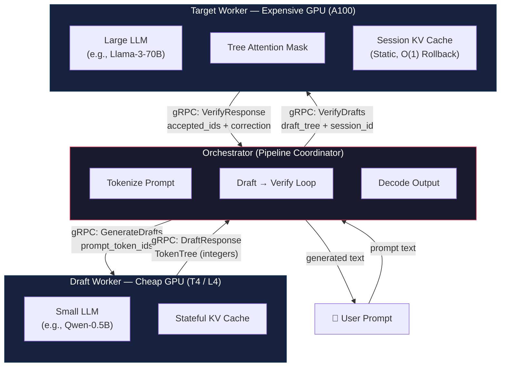

# NetSpec: Disaggregated Speculative Decoding for Commodity Cloud

[](https://github.com/SamvritSrinath/SpecSplit/actions)
[](https://www.python.org/downloads/)
[](./LICENSE)

---

## Table of Contents

1. [The Core Insight](#the-core-insight)
2. [System Architecture](#system-architecture)
3. [Quick Start](#quick-start)
4. [Running the System](#running-the-system)
5. [Running Experiments & Benchmarks](#running-experiments--benchmarks)
6. [Configuration Reference](#configuration-reference)
7. [Project Structure](#project-structure)
8. [License](#license)

---

## The Core Insight

### The VRAM Tax Problem

Monolithic speculative decoding couples two fundamentally asymmetric workloads
onto a single GPU: **cheap autoregressive drafting** (small model, sequential, KV-cache-bound)
and **expensive parallel verification** (large model, batched tree-attention,
compute-bound). Because both models must co-reside in VRAM, operators pay a
**"VRAM Tax"** — the draft model's memory footprint permanently depletes capacity
that could otherwise serve larger batches or bigger target models. This coupling
forces over-provisioning: organizations rent A100-class hardware for a task that is
90% draft generation on what could be a T4.

### The Disaggregation Thesis

NetSpec decouples drafting from verification across the network. The feasibility
of this decomposition rests on a single quantitative inequality:

```
Network Round-Trip Time (RTT)  ≪  Target Model Verification Time

         ~1–2 ms (intra-VPC)   ≪   ~25–35 ms (70B forward pass)
```

Because the transport payload is a **Token Tree** — a lightweight tree of integer
token IDs and scalar log-probabilities — rather than dense floating-point tensors,
the serialized message size is on the order of **hundreds of bytes**, not megabytes.
gRPC serialization and deserialization overhead is negligible relative to the
target model's compute-bound verification step.

### The Economic Argument

By exploiting this latency gap, NetSpec enables a heterogeneous serving topology:

| Component     | Hardware        | Hourly Cost (est.) | Utilization              |
| ------------- | --------------- | ------------------ | ------------------------ |
| Draft Worker  | T4 / L4 (16 GB) | ~$0.35             | ~95% (autoregressive)    |
| Target Worker | A100 (80 GB)    | ~$3.50             | ~85% (batched tree-attn) |

The draft model runs on commodity GPUs at near-full utilization, while the
expensive accelerator is reserved exclusively for high-throughput verification.
The result is a **reduction in cost-per-token** without sacrificing output quality,
since the target model retains final authority over every accepted token.

---

## System Architecture



### Data Flow

1. **User prompt** → Orchestrator tokenizes and sends `prompt_token_ids` to the Draft Worker.
2. **Draft Worker** generates a speculative **Token Tree** of depth K using autoregressive sampling with a local KV cache.
3. **Token Tree + `session_id`** → forwarded to the Target Worker via gRPC.
4. **Target Worker** performs a single batched forward pass with **tree attention** (custom causal masks ensuring each node attends only to its ancestors) to score all candidate paths simultaneously.
5. **Greedy verification** determines the longest accepted prefix:
   - If `argmax(p_target) == argmax(p_draft)` at position _i_: token **accepted**.
   - Otherwise: divergence detected; the target's token is emitted as a **correction**.
6. **Accepted tokens + optional correction** → returned to the Orchestrator.
7. Orchestrator appends accepted tokens, rolls forward the context, and **loops back to step 2**.
8. On completion, the Orchestrator calls `EndSession` to release the Target Worker's KV cache.

### gRPC Protocol (`spec_decoding.proto`)

| Service         | RPC              | Purpose                                    |
| --------------- | ---------------- | ------------------------------------------ |
| `DraftService`  | `GenerateDrafts` | Generate speculative token trees           |
| `DraftService`  | `Ping`           | Health check                               |
| `TargetService` | `VerifyDrafts`   | Verify draft trees (with session KV cache) |
| `TargetService` | `EndSession`     | Release a session's KV cache               |
| `TargetService` | `Ping`           | Health check                               |

**Key message type:** `TokenNode` — a recursive tree node `{token_id, log_prob, children[]}`.

---

## Quick Start

### Prerequisites

- Python ≥ 3.10
- CUDA-capable GPU(s) with PyTorch ≥ 2.0
- `protoc` (via `grpcio-tools`, installed automatically)

### Local Development Setup

```bash
# 1. Clone the repository
git clone https://github.com/SamvritSrinath/SpecSplit.git
cd SpecSplit

# 2. Create and activate a virtual environment (recommended)
python -m venv .venv && source .venv/bin/activate   # Linux/macOS

# 3. Install in editable mode with dev dependencies
pip install -e ".[dev]"

# 4. Generate gRPC Python stubs from protobuf definitions
make proto

# 5. Verify the installation (with venv activated)
make test               # unit tests only
make lint               # ruff linter
make typecheck          # mypy static analysis
```

See [docs/project_guide.md](docs/project_guide.md) for more setup options.

### Development Commands

| Command          | Description                                         |
| ---------------- | --------------------------------------------------- |
| `make install`   | Editable install with dev dependencies              |
| `make proto`     | Generate Python stubs from `.proto` definitions     |
| `make test`      | Run unit tests (excludes integration)               |
| `make test-all`  | Run all tests (unit + integration)                  |
| `make test-cov`  | Run tests with HTML coverage report                 |
| `make lint`      | Run ruff linter                                     |
| `make typecheck` | Run mypy type checker                               |
| `make format`    | Auto-format code with ruff                          |
| `make clean`     | Remove caches, build artifacts, and generated stubs |

---

## Running the System

Launch each component in a **separate terminal window**. The services communicate
over gRPC and are configured via environment variables (prefix `SPECSPLIT_*`) or
Pydantic defaults.

### Terminal 1 — Target Worker

```bash
# Start the Target Worker (large model, expensive GPU)
SPECSPLIT_TARGET_MODEL_NAME=meta-llama/Llama-3-70B \
SPECSPLIT_TARGET_GRPC_PORT=50052 \
    python -m specsplit.workers.target.service
```

### Terminal 2 — Draft Worker

```bash
# Start the Draft Worker (small model, cheap GPU)
SPECSPLIT_DRAFT_MODEL_NAME=Qwen/Qwen2.5-0.5B \
SPECSPLIT_DRAFT_GRPC_PORT=50051 \
SPECSPLIT_DRAFT_MAX_DRAFT_TOKENS=5 \
    python -m specsplit.workers.draft.service
```

### Terminal 3 — Orchestrator (Client)

```bash
# Run a single prompt through the pipeline
SPECSPLIT_ORCH_DRAFT_ADDRESS=localhost:50051 \
SPECSPLIT_ORCH_TARGET_ADDRESS=localhost:50052 \
    python -m specsplit.workers.orchestrator.client \
        --prompt "Explain the key ideas behind quantum computing." \
        --max-rounds 20 \
        --telemetry-output telemetry_spans.json
```

> **Note:** For local testing without GPUs, use CPU mode by setting
> `SPECSPLIT_DRAFT_DEVICE=cpu` and `SPECSPLIT_TARGET_DEVICE=cpu`. CPU mode is
> for development and testing only; performance is not representative of production.

---

## Running Experiments & Benchmarks

NetSpec ships with a purpose-built benchmarking harness at
[`scripts/benchmark_run.py`](scripts/benchmark_run.py) that drives the
orchestrator with a dataset of prompts and records granular per-request metrics.

### Preparing a Dataset

Create a JSONL file with one prompt per line:

```jsonl
{"prompt": "Explain quantum computing to a 5-year-old."}
{"prompt": "Write a Python function that merges two sorted lists.", "id": "code-01"}
{"prompt": "What is the difference between TCP and UDP?"}
```

ShareGPT-format JSONL is also supported (auto-extracts first human turn).

### Basic Benchmark Run

```bash
python scripts/benchmark_run.py \
    --dataset data/prompts.jsonl \
    --output results/baseline.csv
```

### Gamma Sweep (Hyper-parameter Search)

Gamma (K) controls the draft tree depth — the number of speculative tokens per round.
This parameter directly governs the throughput vs. acceptance-rate trade-off and
corresponds to `DraftWorkerConfig.max_draft_tokens`.

Sweep multiple values in a single invocation:

```bash
python scripts/benchmark_run.py \
    --dataset data/prompts.jsonl \
    --output results/gamma_sweep.csv \
    --gamma 1 3 5 8 12
```

### Output Metrics

Each row in the output CSV contains:

| Column                    | Unit   | Description                                                         |
| ------------------------- | ------ | ------------------------------------------------------------------- |
| `request_id`              | —      | Unique identifier per request                                       |
| `gamma`                   | int    | Draft tree depth (K) used                                           |
| `prompt_length`           | tokens | Estimated prompt token count                                        |
| `generated_tokens`        | tokens | Number of output tokens produced                                    |
| `ttft_ms`                 | ms     | **Time-to-First-Token** — latency to produce the first output token |
| `tpot_ms`                 | ms     | **Time-Per-Output-Token** — average inter-token latency             |
| `average_acceptance_rate` | 0–1    | Mean fraction of draft tokens accepted per round                    |
| `total_network_idle_ms`   | ms     | Cumulative gRPC round-trip overhead                                 |
| `total_latency_ms`        | ms     | End-to-end wall-clock time for the full request                     |
| `num_rounds`              | int    | Number of draft→verify iterations executed                          |

### Summary Output

After all runs complete, the harness prints a grouped summary table:

```
==========================================================================================
BENCHMARK SUMMARY
==========================================================================================
 Gamma   Reqs    Avg TTFT    Avg TPOT   Avg Accept   Avg NetIdle   Avg Latency
------------------------------------------------------------------------------------------
     1     50     12.34ms      3.21ms       100.00%       4.12ms       161.23ms
     5     50     14.56ms      2.01ms        87.30%       5.67ms       102.45ms
    12     50     18.90ms      1.45ms        72.10%       7.89ms        74.32ms
==========================================================================================
```

### Overriding Worker Addresses

```bash
SPECSPLIT_ORCH_DRAFT_ADDRESS=gpu1:50051 \
SPECSPLIT_ORCH_TARGET_ADDRESS=gpu2:50052 \
    python scripts/benchmark_run.py \
        --dataset data/prompts.jsonl \
        --max-output-tokens 128 \
        --max-rounds 10
```

---

## Configuration Reference

All configuration is managed via [Pydantic Settings](https://docs.pydantic.dev/latest/concepts/pydantic_settings/)
and can be overridden with environment variables:

| Variable                             | Default                    | Component     | Description                                         |
| ------------------------------------ | -------------------------- | ------------- | --------------------------------------------------- |
| `SPECSPLIT_DRAFT_MODEL_NAME`         | `gpt2`                     | Draft Worker  | HuggingFace model ID                                |
| `SPECSPLIT_DRAFT_DEVICE`             | `cuda:0`                   | Draft Worker  | Torch device string                                 |
| `SPECSPLIT_DRAFT_MAX_DRAFT_TOKENS`   | `5`                        | Draft Worker  | Tree depth (K)                                      |
| `SPECSPLIT_DRAFT_NUM_BEAMS`          | `1`                        | Draft Worker  | Branching factor                                    |
| `SPECSPLIT_DRAFT_GRPC_PORT`          | `50051`                    | Draft Worker  | gRPC listen port                                    |
| `SPECSPLIT_TARGET_MODEL_NAME`        | `meta-llama/Llama-2-7b-hf` | Target Worker | HuggingFace model ID                                |
| `SPECSPLIT_TARGET_DEVICE`            | `cuda:0`                   | Target Worker | Torch device string                                 |
| `SPECSPLIT_TARGET_GRPC_PORT`         | `50052`                    | Target Worker | gRPC listen port                                    |
| `SPECSPLIT_TARGET_MAX_SESSIONS`      | `16`                       | Target Worker | Max concurrent KV sessions                          |
| `SPECSPLIT_TARGET_MAX_TREE_NODES`    | `2048`                     | Target Worker | Max draft tree nodes per request (input validation) |
| `SPECSPLIT_TARGET_MAX_PROMPT_TOKENS` | `8192`                     | Target Worker | Max prompt length per request (input validation)    |
| `SPECSPLIT_ORCH_DRAFT_ADDRESS`       | `localhost:50051`          | Orchestrator  | Draft Worker address                                |
| `SPECSPLIT_ORCH_TARGET_ADDRESS`      | `localhost:50052`          | Orchestrator  | Target Worker address                               |
| `SPECSPLIT_ORCH_MAX_ROUNDS`          | `20`                       | Orchestrator  | Max draft→verify rounds                             |
| `SPECSPLIT_ORCH_TIMEOUT_S`           | `30.0`                     | Orchestrator  | Per-RPC timeout (seconds)                           |
| `SPECSPLIT_ORCH_MAX_OUTPUT_TOKENS`   | `256`                      | Orchestrator  | Max tokens per generation                           |

---

## Security and deployment

- **No built-in auth or TLS:** gRPC services listen on plain TCP. Use only in
  trusted networks (e.g. same VPC). For untrusted or internet-facing deployments,
  add authentication (e.g. gRPC interceptors) and TLS.
- **Input limits:** The Target Worker rejects requests whose prompt length or
  draft tree size exceeds `SPECSPLIT_TARGET_MAX_PROMPT_TOKENS` and
  `SPECSPLIT_TARGET_MAX_TREE_NODES` to limit resource use.

---

## Project Structure

```
specsplit/
├── proto/
│   └── spec_decoding.proto          # gRPC service & message definitions
├── core/
│   ├── config.py                    # Pydantic settings (env-var driven)
│   ├── serialization.py             # Tensor ↔ list conversion at gRPC boundary
│   ├── telemetry.py                 # Nanosecond-precision timing + JSON spans
│   └── verification.py              # Greedy tree verification (argmax + DFS)
├── workers/
│   ├── draft/
│   │   ├── engine.py                # Autoregressive draft tree generation
│   │   └── service.py               # DraftService gRPC server
│   ├── target/
│   │   ├── engine.py                # Session-based tree-attention verification
│   │   ├── tree_attn.py             # Custom tree attention mask construction
│   │   ├── kv_cache.py              # Pre-allocated static KV cache (O(1) rollback)
│   │   └── service.py               # TargetService gRPC server
│   └── orchestrator/
│       ├── client.py                # CLI entry point + synchronous pipeline
│       └── pipeline.py              # Async overlapped draft→verify with speculation
tests/
├── unit/                            # Fast, mocked tests (no GPU required)
└── integration/                     # Network + model integration tests
scripts/
└── benchmark_run.py                 # Load-testing harness with gamma sweep
docs/
├── architecture.md                  # Detailed architecture documentation
├── experiments.md                   # Experiment running guide
├── project_guide.md                 # Developer onboarding guide
└── testing.md                       # Testing strategy documentation
```

---

## License

MIT — see [LICENSE](./LICENSE).
