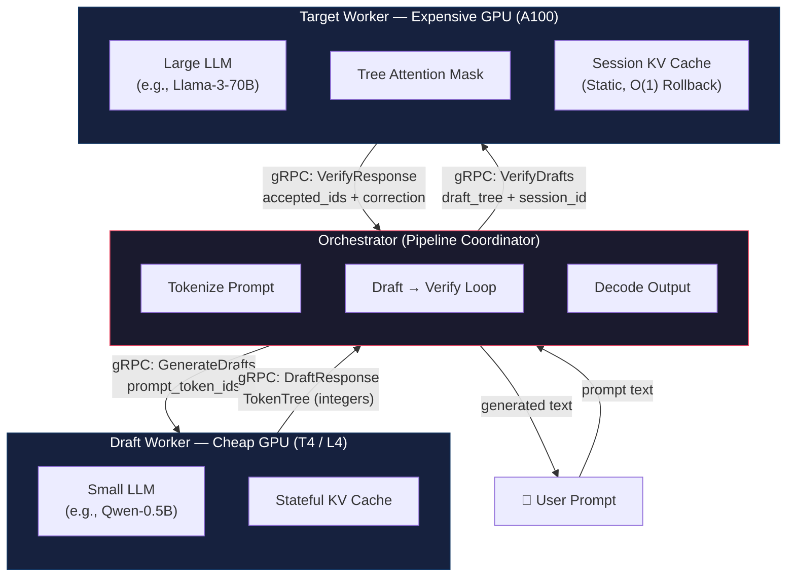

# NetSpec: Disaggregated Speculative Decoding for Commodity Cloud

[](https://github.com/SamvritSrinath/SpecSplit/actions)
[](https://www.python.org/downloads/)
[](./LICENSE)

Documentation:

- Persistent MkDocs site: <https://samvritsrinath.github.io/SpecSplit/>

---

## Table of Contents

1. [Quick Start](#quick-start)
2. [Docs](#docs)
3. [License](#license)

---

## The Core Insight

### The VRAM Tax Problem

Monolithic speculative decoding couples two fundamentally asymmetric workloads
onto a single GPU: **cheap autoregressive drafting** (small model, sequential, KV-cache-bound)
and **expensive parallel verification** (large model, batched tree-attention,
compute-bound). Because both models must co-reside in VRAM, operators pay a
**"VRAM Tax"** — the draft model's memory footprint permanently depletes capacity
that could otherwise serve larger batches or bigger target models. This coupling
forces over-provisioning: organizations rent A100-class hardware for a task that is
90% draft generation on what could be a T4.

### The Disaggregation Thesis

NetSpec decouples drafting from verification across the network. The feasibility
of this decomposition rests on a single quantitative inequality:

```
Network Round-Trip Time (RTT)  ≪  Target Model Verification Time

         ~1–2 ms (intra-VPC)   ≪   ~25–35 ms (70B forward pass)
```

Because the transport payload is a **Token Tree** — a lightweight tree of integer
token IDs and scalar log-probabilities — rather than dense floating-point tensors,
the serialized message size is on the order of **hundreds of bytes**, not megabytes.
gRPC serialization and deserialization overhead is negligible relative to the
target model's compute-bound verification step.

### The Economic Argument

By exploiting this latency gap, NetSpec enables a heterogeneous serving topology:

| Component     | Hardware        | Hourly Cost (est.) | Utilization              |
| ------------- | --------------- | ------------------ | ------------------------ |
| Draft Worker  | T4 / L4 (16 GB) | ~$0.35             | ~95% (autoregressive)    |
| Target Worker | A100 (80 GB)    | ~$3.50             | ~85% (batched tree-attn) |

The draft model runs on commodity GPUs at near-full utilization, while the
expensive accelerator is reserved exclusively for high-throughput verification.
The result is a **reduction in cost-per-token** without sacrificing output quality,
since the target model retains final authority over every accepted token.

---

## System Architecture


```mermaid
graph TB
    User["👤 User Prompt"]

    subgraph Orchestrator["Orchestrator (Pipeline Coordinator)"]
        direction TB
        Tokenize["Tokenize Prompt"]
        Loop["Draft → Verify Loop"]
        Decode["Decode Output"]
    end

    subgraph DraftWorker["Draft Worker — Cheap GPU (T4 / L4)"]
        direction TB
        DraftLLM["Small LLM<br/>(e.g., Qwen-0.5B)"]
        DraftKV["Stateful KV Cache"]
    end

    subgraph TargetWorker["Target Worker — Expensive GPU (A100)"]
        direction TB
        TargetLLM["Large LLM<br/>(e.g., Llama-3-70B)"]
        TreeAttn["Tree Attention Mask"]
        SessionKV["Session KV Cache<br/>(Static, O(1) Rollback)"]
    end

    User -->|"prompt text"| Orchestrator
    Orchestrator -->|"gRPC: GenerateDrafts<br/>prompt_token_ids"| DraftWorker
    DraftWorker -->|"gRPC: DraftResponse<br/>TokenTree (integers)"| Orchestrator
    Orchestrator -->|"gRPC: VerifyDrafts<br/>draft_tree + session_id"| TargetWorker
    TargetWorker -->|"gRPC: VerifyResponse<br/>accepted_ids + correction"| Orchestrator
    Orchestrator -->|"generated text"| User

    style Orchestrator fill:#1a1a2e,stroke:#e94560,color:#fff
    style DraftWorker fill:#16213e,stroke:#0f3460,color:#fff
    style TargetWorker fill:#16213e,stroke:#0f3460,color:#fff
```

### Data Flow

1. **User prompt** → Orchestrator tokenizes and sends `prompt_token_ids` to the Draft Worker.
2. **Draft Worker** generates a speculative **Token Tree** of depth K using autoregressive sampling with a local KV cache.
3. **Token Tree + `session_id`** → forwarded to the Target Worker via gRPC.
4. **Target Worker** performs a single batched forward pass with **tree attention** (custom causal masks ensuring each node attends only to its ancestors) to score all candidate paths simultaneously.
5. **Greedy verification** determines the longest accepted prefix:
   - If `argmax(p_target) == argmax(p_draft)` at position _i_: token **accepted**.
   - Otherwise: divergence detected; the target's token is emitted as a **correction**.
6. **Accepted tokens + optional correction** → returned to the Orchestrator.
7. Orchestrator appends accepted tokens, rolls forward the context, and **loops back to step 2**.
8. On completion, the Orchestrator calls `EndSession` to release the Target Worker's KV cache.

### gRPC Protocol (`spec_decoding.proto`)

| Service         | RPC              | Purpose                                    |
| --------------- | ---------------- | ------------------------------------------ |
| `DraftService`  | `GenerateDrafts` | Generate speculative token trees           |
| `DraftService`  | `Ping`           | Health check                               |
| `TargetService` | `VerifyDrafts`   | Verify draft trees (with session KV cache) |
| `TargetService` | `EndSession`     | Release a session's KV cache               |
| `TargetService` | `Ping`           | Health check                               |

**Key message type:** `TokenNode` — a recursive tree node `{token_id, log_prob, children[]}`.

---

## Quick Start

### Prerequisites

- Python ≥ 3.10
- CUDA-capable GPU(s) with PyTorch ≥ 2.0
- `protoc` (via `grpcio-tools`, installed automatically)

### Local Development Setup

```bash
# 1. Clone the repository
git clone https://github.com/SamvritSrinath/SpecSplit.git
cd SpecSplit

# 2. Create and activate a virtual environment (recommended)
python -m venv .venv && source .venv/bin/activate   # Linux/macOS

# 3. Install in editable mode with dev dependencies
pip install -e ".[dev]"

# 4. Generate gRPC Python stubs from protobuf definitions
make proto

# 5. Verify the installation (with venv activated)
make test               # unit tests only
make lint               # ruff linter
make typecheck          # mypy static analysis
```

See [docs/project_guide.md](docs/project_guide.md) for more setup options.

### Development Commands

| Command          | Description                                         |
| ---------------- | --------------------------------------------------- |
| `make install`   | Editable install with dev dependencies              |
| `make proto`     | Generate Python stubs from `.proto` definitions     |
| `make test`      | Run unit tests (excludes integration)               |
| `make test-all`  | Run all tests (unit + integration)                  |
| `make test-cov`  | Run tests with HTML coverage report                 |
| `make lint`      | Run ruff linter                                     |
| `make typecheck` | Run mypy type checker                               |
| `make format`    | Auto-format code with ruff                          |
| `make clean`     | Remove caches, build artifacts, and generated stubs |

### Running tests

- **Unit tests** (fast, no model download):  
  `make test` or `pytest tests/unit/ -v`

---

## Running the System

Run the services in three terminals (details: `docs/project_guide.md`).

### Terminal 1 — Target Worker

```bash
SPECSPLIT_TARGET_MODEL_NAME=meta-llama/Llama-2-7b-hf \
SPECSPLIT_TARGET_DEVICE=cuda:0 \
    python -m specsplit.workers.target.service
```

### Terminal 2 — Draft Worker

```bash
SPECSPLIT_DRAFT_MODEL_NAME=gpt2 \
SPECSPLIT_DRAFT_DEVICE=cuda:0 \
    python -m specsplit.workers.draft.service
```

### Terminal 3 — Orchestrator (Client)

```bash
python -m specsplit.workers.orchestrator.client \
    --prompt "What is the Capital of France?" \
    --max-rounds 20 \
    --max-output-tokens 256 \
    --max-draft-tokens 3 \
    --draft-temperature 0.15 \
    --verify-temperature 0.15 \
    --use-target-cache
```

---

## Running Experiments & Benchmarks

See [docs/experiments.md](docs/experiments.md) and use the canonical benchmark harness.

```bash
python benchmarks/runner.py \
  --prompts data/prompts.jsonl \
  --results-dir benchmarks/results/custom \
  --draft-addr localhost:50051 \
  --target-addr localhost:50052 \
  --tokenizer gpt2 \
  --gamma 5 \
  --max-rounds 20 \
  --max-output-tokens 128
```

---

## Docs

- Configuration + service startup: [`docs/project_guide.md`](docs/project_guide.md)
- Experiments + benchmark harness: [`docs/experiments.md`](docs/experiments.md)

## Security and deployment

For deployment notes, see `docs/testing.md`.

Remote worker lifecycle helpers are in `scripts/manage_remote_worker.sh`.

---

## Project Structure

For deployment notes, see `docs/testing.md`.

Remote worker lifecycle helpers are in `scripts/manage_remote_worker.sh`.

---

## Project Structure

See the repository layout section in `docs/project_guide.md`.

---

## License

MIT — see [LICENSE](./LICENSE).
